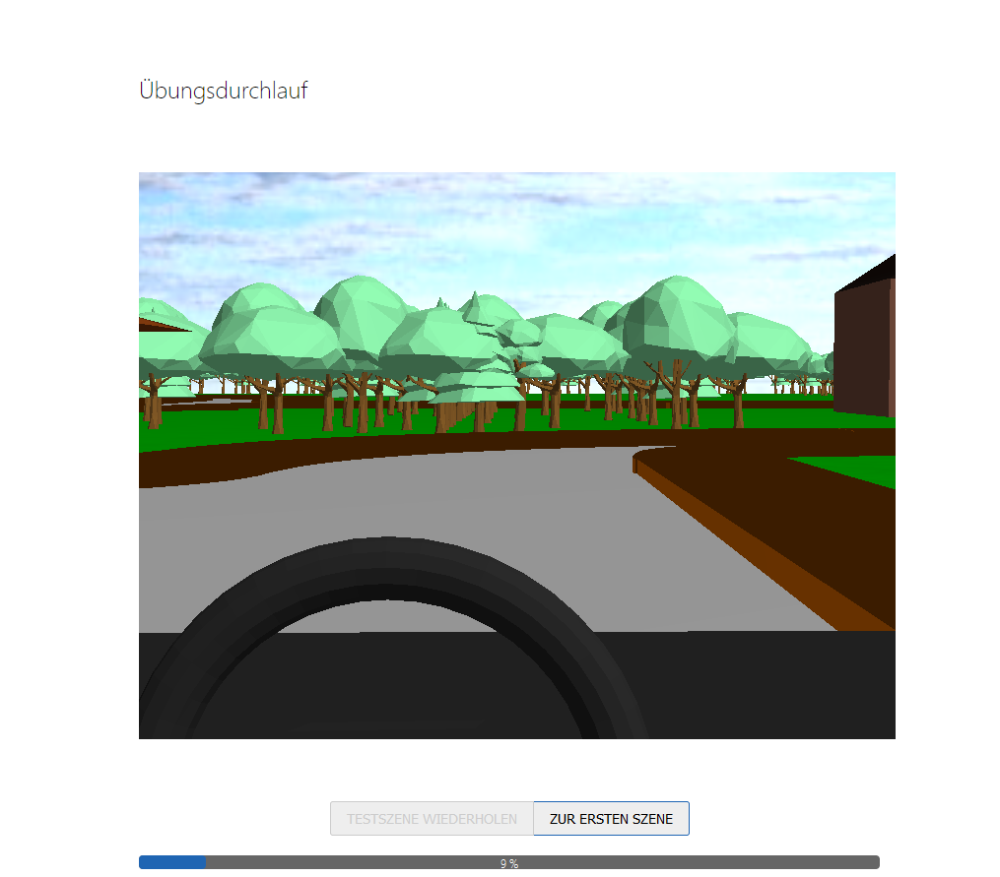
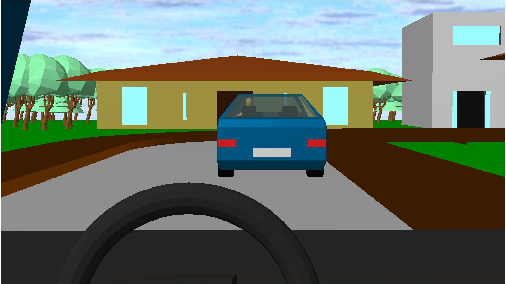
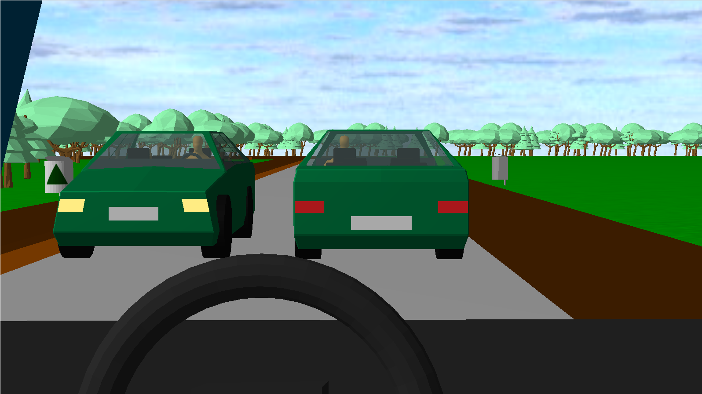
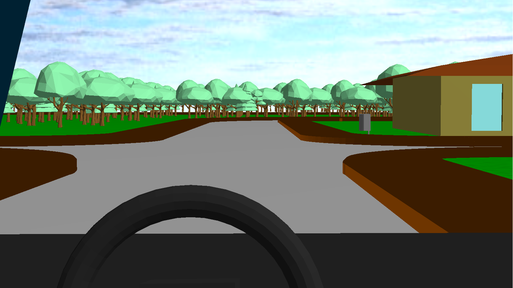
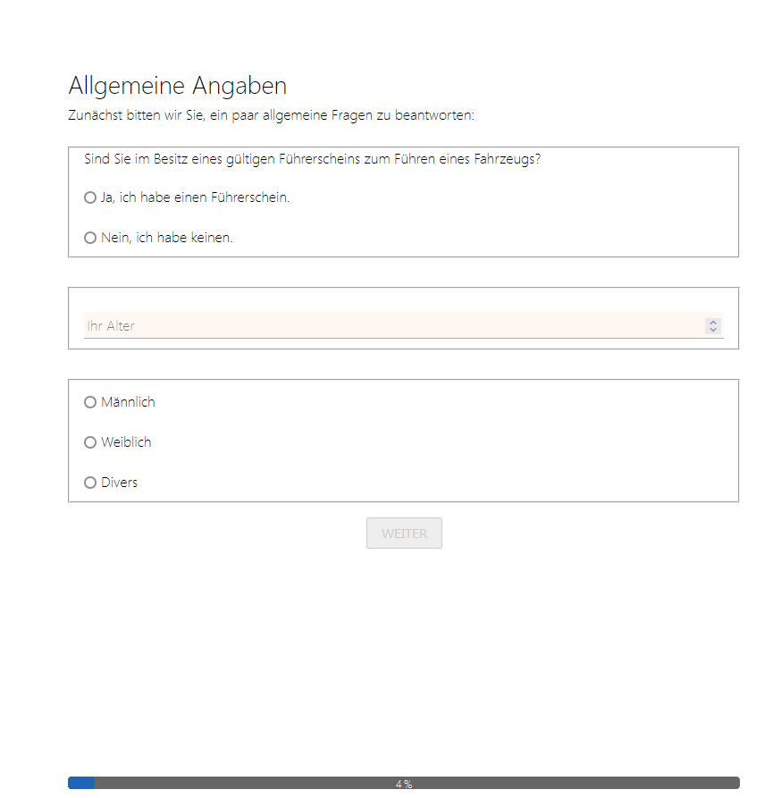

# Online Survey - Autonomous Cars

Survey software showing different scenes with autonomous and non-autonomous cars that are rendered in the browser via Three.js.

Also includes a "world editor" in which the individual scenes can be generated and exported as JSON world configuration files.

## Screenshots

<table style="border:none;">
  <tr>
    <td>
      
    </td>
    <td>
      
    </td>
  </tr>
  <tr>
    <td>
      
    </td>
    <td>
      
    </td>
  </tr>
  <tr>
    <td>
      
    </td>
    <td></td>
  </tr>
</table>